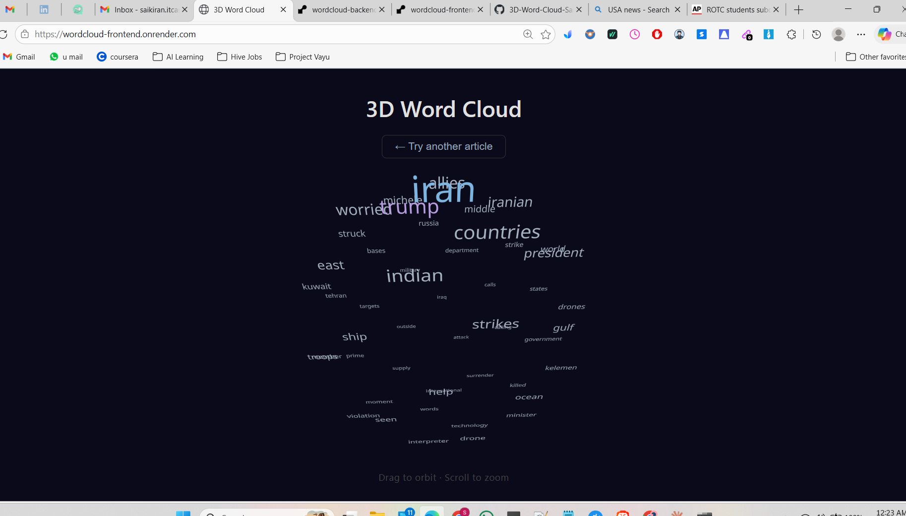
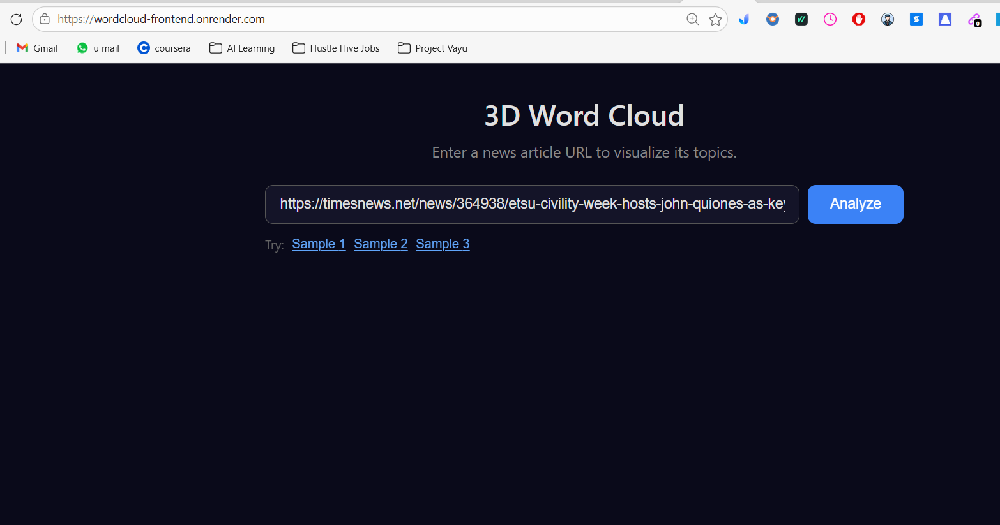
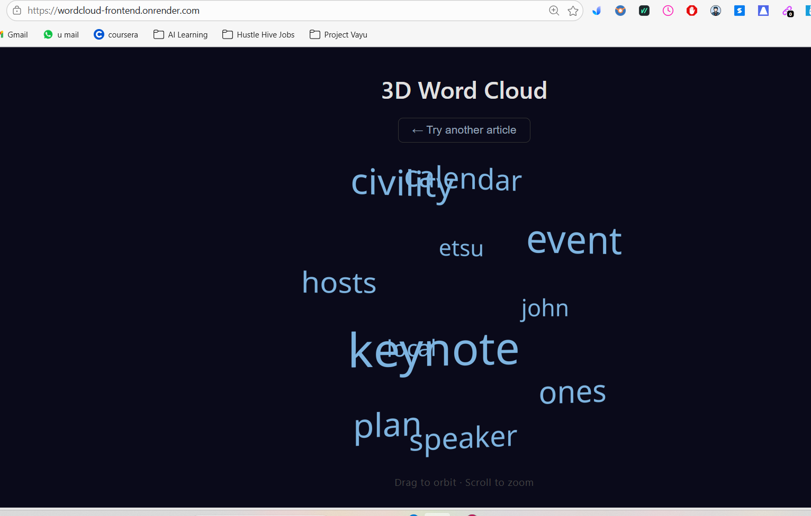
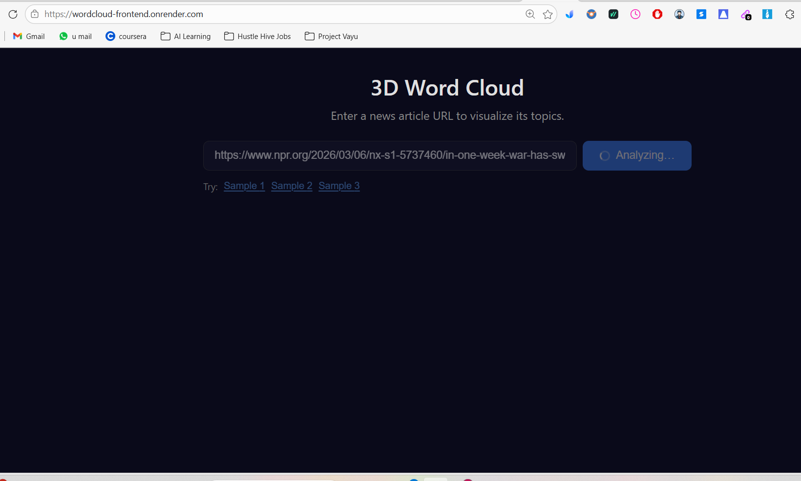
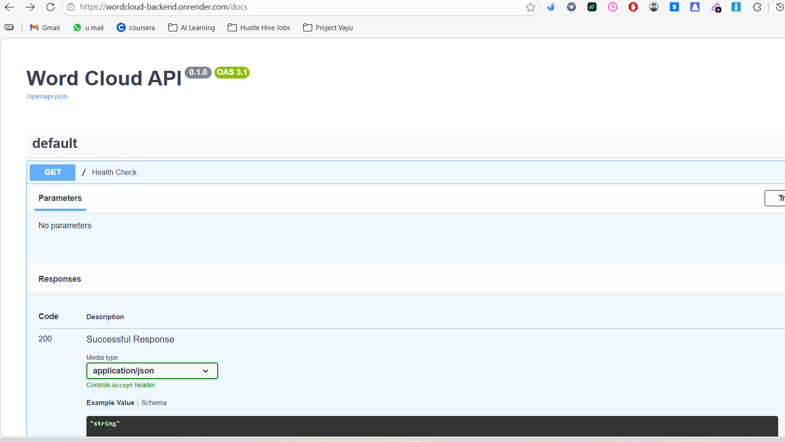
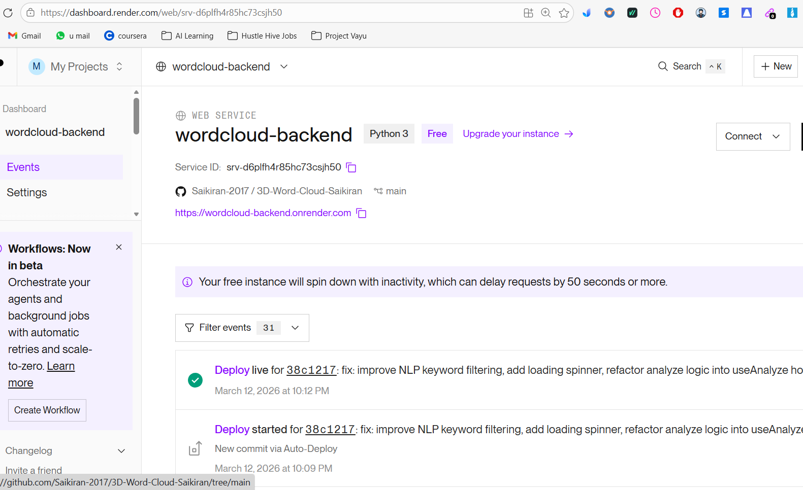
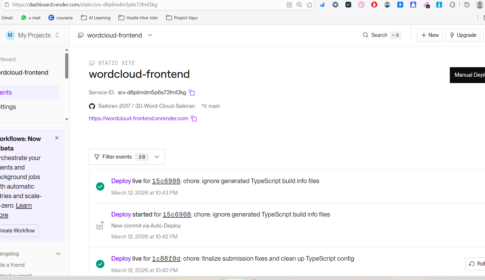
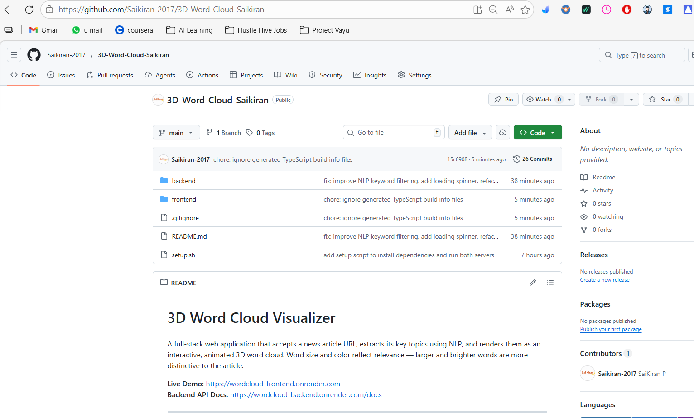

# 3D Word Cloud Visualizer

A full-stack web application that accepts a news article URL, extracts its key topics using NLP, and renders them as an interactive, animated 3D word cloud. Word size and color reflect relevance — larger and brighter words are more distinctive to the article.

**Live Demo:** https://wordcloud-frontend.onrender.com  
**Backend API Docs:** https://wordcloud-backend.onrender.com/docs  
**Repository:** https://github.com/Saikiran-2017/3D-Word-Cloud-Saikiran

<p align="center">
  
</p>

## Live Demo
Frontend: https://wordcloud-frontend.onrender.com
Backend API Docs: https://wordcloud-backend.onrender.com/docs
---

## Screenshots

### Application Interface







### API Documentation



### Deployment

Backend deployed on Render



Frontend deployed on Render



### Repository



---

## Features

- Paste any news article URL and receive a 3D topic visualization in seconds
- Word size and color tier driven by TF-IDF relevance score
- Interactive 3D scene: drag to orbit, scroll to zoom, hover to highlight
- Auto-rotating word cloud rendered with React Three Fiber
- Clean loading and error states throughout the flow
- Sample article links pre-populated for quick testing

---

## Tech Stack

| Layer    | Technology                                                    |
|----------|---------------------------------------------------------------|
| Frontend | React 18, TypeScript, Vite, Three.js, React Three Fiber, Drei |
| Backend  | Python 3.10+, FastAPI, scikit-learn (TF-IDF), BeautifulSoup, httpx |

---

## Prerequisites

- **Node.js** 18 or higher (`node --version`)
- **Python** 3.10 or higher (`python3 --version`)
- **pip3** available on PATH

---

## Setup Instructions

### One-command setup (macOS / Linux)

The `setup.sh` script at the repository root installs all dependencies and starts both servers concurrently:

```bash
chmod +x setup.sh
./setup.sh
```

Then open **http://localhost:5173** in your browser.

The script will:
1. Check for `node`, `npm`, `python3`, and `pip3`
2. Run `pip3 install -r requirements.txt` in `backend/`
3. Run `npm install` in `frontend/`
4. Start the FastAPI backend on port **8000**
5. Start the Vite dev server on port **5173**

---

## Running Locally

### Manual setup (alternative to setup.sh)

**Backend** (Python 3.10+):

```bash
cd backend
pip3 install -r requirements.txt
python3 -m uvicorn main:app --reload --port 8000
```

**Frontend** (Node 18+):

```bash
cd frontend
npm install
npm run dev
```

The frontend runs on **http://localhost:5173** and the backend on **http://localhost:8000**.

---

## Environment Variables

The frontend reads `VITE_API_URL` to determine which backend to talk to.

| File                    | Purpose                                          |
|-------------------------|--------------------------------------------------|
| `frontend/.env`         | Committed defaults — points to `localhost:8000` |
| `frontend/.env.production` | Used by `npm run build` — points to the deployed backend |
| `frontend/.env.local`   | Local override (git-ignored) — create if needed |

**Default local behavior:** `VITE_API_URL=http://localhost:8000` — the frontend talks to your local backend when running `npm run dev`.

To override locally without editing committed files:

```bash
echo "VITE_API_URL=http://localhost:8000" > frontend/.env.local
```

---

## API Overview

### `POST /analyze`

Accepts a news article URL and returns extracted keywords with relevance weights.

**Request:**

```json
{ "url": "https://www.npr.org/..." }
```

**Response `200 OK`:**

```json
{
  "words": [
    { "word": "iran",    "weight": 1.0   },
    { "word": "allies",  "weight": 0.397 },
    { "word": "strikes", "weight": 0.223 }
  ]
}
```

Weights are min-max normalized to the `0.0–1.0` range (floored at `0.1` so every word is visible). The endpoint returns up to 50 keywords by default.

**Error responses:**

| Status | Condition                                           |
|--------|-----------------------------------------------------|
| 400    | Invalid or unreachable URL                          |
| 422    | Page fetched successfully but no meaningful text found |

### `GET /`

Health check — returns `{ "status": "ok" }`.

---

## Project Structure

```
├── backend/
│   ├── main.py                 # FastAPI app, CORS config, /analyze endpoint
│   ├── requirements.txt
│   └── services/
│       ├── scraper.py          # Article fetching and HTML text extraction
│       └── nlp.py              # TF-IDF keyword extraction and scoring
├── frontend/
│   ├── index.html
│   ├── package.json
│   ├── vite.config.ts
│   ├── .env                    # Default API target (localhost:8000)
│   ├── .env.production         # Production API target (Render deployment)
│   └── src/
│       ├── App.tsx             # Root component — renders URLInput or WordCloudScene
│       ├── vite-env.d.ts       # VITE_API_URL type declaration
│       ├── types/index.ts      # Shared TypeScript interfaces
│       ├── hooks/
│       │   └── useAnalyze.ts   # API call logic, loading, and error state
│       └── components/
│           ├── URLInput.tsx    # URL form with sample links and loading spinner
│           └── WordCloudScene.tsx  # 3D word cloud renderer
├── setup.sh                    # One-command install and run (macOS / Linux)
└── README.md
```

---

## Architecture Notes

1. **User** pastes an article URL in the `URLInput` component
2. **`useAnalyze` hook** sends `POST /analyze` to the backend
3. **Scraper** (`scraper.py`) fetches the raw HTML, strips nav/footer/byline noise, and returns cleaned paragraph text
4. **NLP module** (`nlp.py`) splits text into sentence chunks, applies TF-IDF across chunks, filters stop words and boilerplate tokens, and returns the top 50 keywords with min-max normalized weights
5. **`WordCloudScene`** distributes words on a Fibonacci sphere, maps weight to font size and color tier, and renders them via React Three Fiber's `Text` component
6. The cloud auto-rotates on the Y-axis; `OrbitControls` enables orbit and zoom; each word responds to hover

---

## Libraries Used

### Frontend

| Library                | Purpose                                               |
|------------------------|-------------------------------------------------------|
| React 18               | UI component framework                                |
| TypeScript             | Static typing across the frontend                     |
| Vite                   | Fast dev server and bundler                           |
| Three.js               | 3D rendering engine                                   |
| @react-three/fiber     | React renderer for Three.js                           |
| @react-three/drei      | Helpers: `Text` (3D text), `OrbitControls`            |

### Backend

| Library          | Purpose                                                    |
|------------------|------------------------------------------------------------|
| FastAPI          | REST API framework with automatic OpenAPI docs             |
| uvicorn          | ASGI server to run FastAPI                                 |
| httpx            | Async-capable HTTP client for fetching article HTML        |
| BeautifulSoup4   | HTML parsing and boilerplate stripping                     |
| lxml             | Fast HTML parser backend for BeautifulSoup                 |
| scikit-learn     | `TfidfVectorizer` for keyword extraction and scoring       |
| pydantic         | Request/response schema validation                         |

---

## Known Limitations

- **JavaScript-rendered pages** (SPAs, paywalled sites) may return incomplete text — scraping uses plain HTTP, not a headless browser
- **Transcript-heavy articles** (e.g., NPR radio transcripts) may surface interview-subject names alongside topic words; speaker labels are stripped but subject names are not filtered
- **Short articles** (< 5 paragraphs) produce fewer distinctive TF-IDF scores, so the word cloud may be sparse
- **Scraping is basic** — not designed to handle every edge case (login walls, CAPTCHA, rate limiting)
- Desktop-first layout; no mobile-specific responsive design
